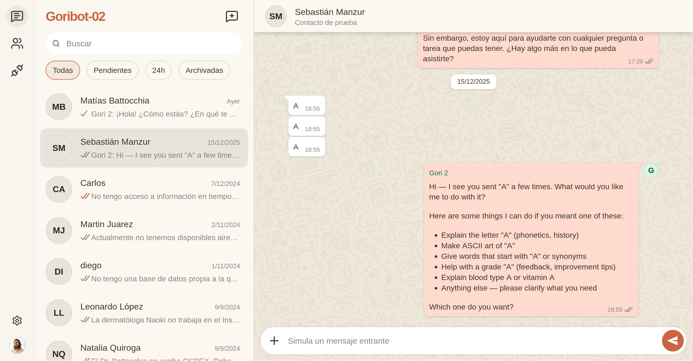

# Open BSP UI

A beautiful WhatsApp Web clone designed to work seamlessly with [Open BSP API](https://github.com/matiasbattocchia/open-bsp-api).

- 📱 Responsive design
- 📲 Works on mobile
- 📝 WhatsApp templates
- 🖼️ Send and receive media

<p align="center">
  
</p>

> [!IMPORTANT]
> **Sign up for a free account and try it out at [open-bsp-ui.pages.dev](https://open-bsp-ui.pages.dev)**! Requires a Google account.

## Deployment

As a Single Page Application, this project can be hosted on any static site hosting service. We recommend **Cloudflare Pages** for its speed and ease of use.

### Deploying to Cloudflare Pages

1. **Fork** this repository.
2. Go to the [Cloudflare Dashboard](https://dash.cloudflare.com/).
3. Navigate to **Workers & Pages** > **Create application** > **Pages** > **Connect to Git**.
4. Connect GitHub and select your forked repository.
5. Use the following build settings:
   - Production branch: `main`
   - Framework preset: `React (Vite)`
   - Build command: `npm run build`
   - Build output directory: `dist`
6. Set environment variables:
    - **VITE_SUPABASE_URL**
    - **VITE_SUPABASE_ANON_KEY**
    - **VITE_META_APP_ID** — Optional. Needed for WhatsApp.
    - **VITE_FB_LOGIN_CONFIG_ID** — Optional. Needed for Tech Provider. 
    
    Get the login config ID from Facebook Login for Business > Configurations > Configuration ID
7. Click **Save and deploy**. Ualá!

<!--
## Tech stack

This project is a Single Page Application (SPA) built with modern web technologies.

-   **Build tool**: [Vite](https://vitejs.dev/)
-   **UI framework**: [React](https://react.dev/)
-   **Styling**: [Tailwind CSS](https://tailwindcss.com/)
-   **Routing**: [TanStack Router](https://tanstack.com/router)
-   **State management**: [Zustand](https://zustand-demo.pmnd.rs/)
-   **Data fetching**: [TanStack Query](https://tanstack.com/query)
-->

## Getting started locally

Install dependencies:

```bash
npm install
```

Run the development server:

```bash
npm run dev
```

Open [http://localhost:5173](http://localhost:5173) in your browser.
