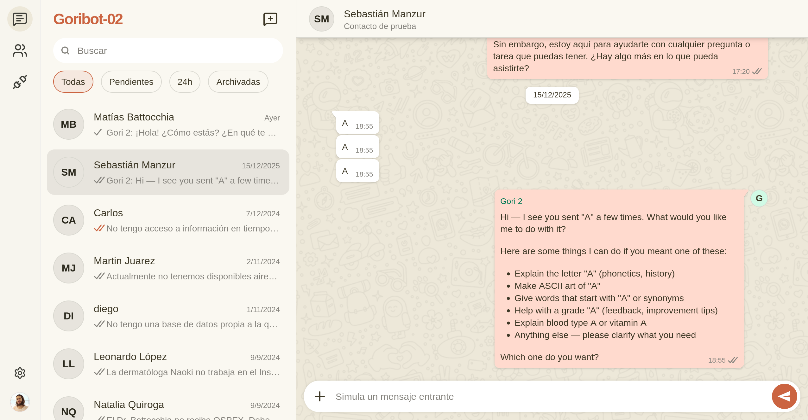

# Open BSP UI

Open-source WhatsApp Web interface for [Open BSP API](https://github.com/matiasbattocchia/open-bsp-api).

[](https://unlicense.org/)
[](https://web.openbsp.dev)

<p align="center">
  
</p>

> [!IMPORTANT]
> **Try it out at [web.openbsp.dev](https://web.openbsp.dev)**! Free account with Google sign-in.

## Features

- **Conversations** — Real-time WhatsApp-style chat with media support (images, audio, documents), message status indicators, and inline template sending
- **Contacts** — Address book with phone validation and bulk management
- **AI Agents** — Create and configure agents with any LLM provider, set tools (MCP, SQL, HTTP), temperature, instructions, and handoff rules
- **Templates** — WhatsApp message template builder with variable pills, formatting preview, and category management
- **Integrations** — WhatsApp Business account connection via Embedded Signup, media preprocessing configuration
- **Settings** — Organization management, team members with roles (owner/admin/member), API keys, webhooks
- **Stats** — Usage charts and billing quota dashboards
- **Multi-org** — Switch between organizations; invite and onboard team members
- **Dark mode** — Full dark theme support
- **Responsive** — Mobile-first design

<!--
## Tech stack

This project is a Single Page Application (SPA) that communicates directly with Supabase (PostgREST + Realtime).

-   **Build tool**: [Vite](https://vitejs.dev/)
-   **UI framework**: [React](https://react.dev/)
-   **Styling**: [Tailwind CSS](https://tailwindcss.com/)
-   **Routing**: [TanStack Router](https://tanstack.com/router)
-   **State management**: [Zustand](https://zustand-demo.pmnd.rs/)
-   **Data fetching**: [TanStack Query](https://tanstack.com/query)
-->

## Getting started locally

You need a running [Open BSP API](https://github.com/matiasbattocchia/open-bsp-api) — either locally via `npx supabase start` or a hosted Supabase project.

```bash
npm install
```

Create a `.env` file:

```env
VITE_SUPABASE_URL=http://localhost:54321     # or your Supabase project URL
VITE_SUPABASE_ANON_KEY=your-anon-key
# VITE_META_APP_ID=                          # optional, for WhatsApp Embedded Signup
# VITE_FB_LOGIN_CONFIG_ID=                   # optional, for Tech Provider flow
```

Start the dev server:

```bash
npm run dev
```

Open [http://localhost:5173](http://localhost:5173).

## Development

### i18n (Internationalization)

The UI is written in Spanish (the default language) and supports English and Portuguese translations. All user-facing strings use the `t()` function from `src/hooks/useTranslation.tsx`, which returns the Spanish key as-is or looks up a translation from `public/locales/{lang}.json`.

**Adding new strings**: wrap any user-facing text with `t("Texto en español")`. The Spanish key is the source of truth — no entry in `en.json`/`pt.json` means the Spanish text is shown.

**Adding translations**: add the corresponding entries to `public/locales/en.json` and `public/locales/pt.json`.

**Checking for drift**: run the sync script to detect missing or stale keys:

```bash
./scripts/sync-translations.sh
```

## Deployment

As an SPA, this project can be hosted on any static site hosting service.

### Cloudflare Pages

1. **Fork** this repository (`main` branch)
2. Go to the [Cloudflare Dashboard](https://dash.cloudflare.com/) > **Workers & Pages** > **Create application** > **Pages** > **Connect to Git**
3. Select your fork and use these build settings:
   - Production branch: `main`
   - Framework preset: `React (Vite)`
   - Build command: `npm run build`
   - Build output directory: `dist`
4. Set environment variables: `VITE_SUPABASE_URL`, `VITE_SUPABASE_ANON_KEY` (and optionally `VITE_META_APP_ID`, `VITE_FB_LOGIN_CONFIG_ID`)
5. **Save and deploy**
